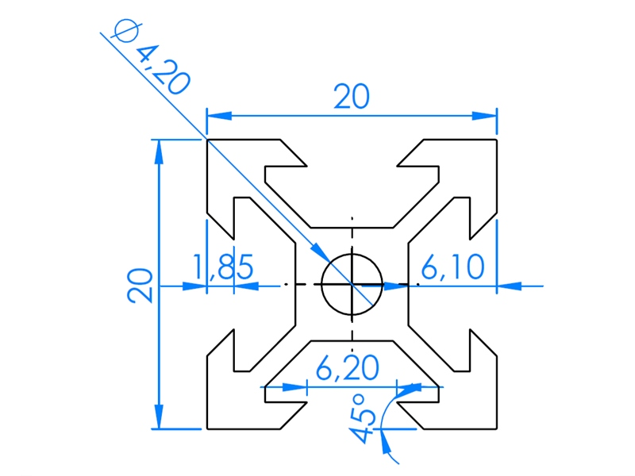

# 3D Printed Parts

## Nema 23 MotorFlange

|Sketch|Pad|
|:---:|:---:|
|||

* FreeCAD Files:
  * [Nema23_MotorFlange.FCStd](./MotorFlange/Nema23_MotorFlange.FCStd)
  * [Nema23_MotorFlange-Body_MotorFlange.3mf](./MotorFlange/Nema23_MotorFlange-Body_MotorFlange.3mf)

## Cable Manement

### Parts

|KabelBojle_udvendig||
|:---:|:---:|
|||

|KabelBojle_Indvendig||
|:---:|:---:|
|||

|Body_KabelBøjle_med_Bro||
|:---:|:---:|
|||
|||

* FreeCAD Files:
  * Print settings:
    * Layer: 0,25mm STRUCTURAL
    * Wipe tower: off
  * Filament:
    * Spectrum Premium PLA
  * [CableManement.FCStd](./Cable_Management/CableManement.FCStd)
  * [CableManement-Body_KabelBojle_Indvendig.3mf](./Cable_Management/3mf/CableManement-Body_KabelBojle_Indvendig.3mf)
  * [CableManement-Body_KabelBojle_udvendig.3mf](./Cable_Management/3mf/CableManement-Body_KabelBojle_udvendig.3mf)
  * [CableManement-Body_KabelBøjle_med_Bro.3mf](./Cable_Management/3mf/CableManement-Body_KabelBøjle_med_Bro.3mf)
  * 
  * 

## GT3 BeltTensioner

