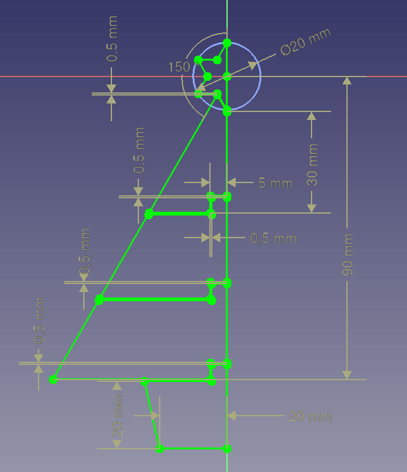

# ChristmasTree Step by Step Guidance

## Create New File

* Open FreeCAD in **Spreadsheet Workbench**
  * Create Master Spreadsheet
    * 
  * Save As: ChristmasTree_MasterSketch.FCStd

## Create the Master Sketch

* Select **Sketcher Workbench**
  * Create Sketch
    * Sketch orientation: XY-Plane
    * [Master Sketch](./ChristmasTree_MasterSketch.FCStd)
    * 
    * Save: **ChristmasTree_MasterSketch.FCStd**

## Explode Compound

* Select **Part Workbench**
  * Select **Sketch**
    * Select **Part->Compound->Explode compound**
    * 
  * Save As: **ChristmasTree_ExplodeCompound.FCStd**

## Pad Explode Compound Sketched

* Select **Part Design Workbench**
  * Select **Combo View-> Sketch.0**
    * Create **Body**
    * Select **Body->BaseFeature**
    * Pad
      * Type: Dimension
      * Length: **Spreadsheet.vBody_Length**
      * Symmetric to plane: **true**
  * Select **Combo View->Sketch.1**
    * Create **Body001**
    * Select **Body001->BaseFeature001**
    * Pad
      * Type: Dimension
      * Length: **Spreadsheet.vBody_Length**
      * Symmetric to plane: **true**
  * Select **Combo View->Sketch.2**
    * Create **Body002**
    * Select **Body002->BaseFeature002**
    * Pad
      * Type: Dimension
      * Length: **Spreadsheet.vBody_Length**
      * Symmetric to plane: **true**
  * Select Combo **View->Sketch.3**
    * Create **Body003**
    * Select **Body003->BaseFeature003**
    * Pad
      * Type: Dimension
      * Length: **Spreadsheet.vBody_Length**
      * Symmetric to plane: **true**
  * Select Combo **View->Sketch.4**
    * Create **Body004**
    * Select **Body004->BaseFeature004**
    * Pad
      * Type: Dimension
      * Length: **Spreadsheet.vBody_Length**
      * Symmetric to plane: **true**
  * 
  * Save As: **ChristmasTree_PadCompound.FCStd**

## Connect Element with Hinge
