# ChristmasTree Step by Step Guidance

## Create New File

* Open FreeCAD in **Spreadsheet Workbench**
  * Create Master Spreadsheet
    * 
  * Save As: ChristmasTree_MasterSketch.FCStd

## Create the Master Sketch

* Select **Sketcher Workbench**
  * Create Sketch
    * Sketch orientation: XY-Plane
    * [Master Sketch](./ChristmasTree_MasterSketch.FCStd)
    * 
    * Save: **ChristmasTree_MasterSketch.FCStd**

## Explode Compound

* Select **Part Workbench**
  * Select **Sketch**
    * Select **Part->Compound->Explode compound**
    * 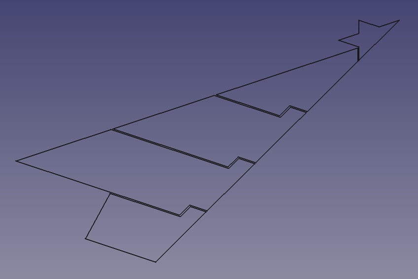
  * Save As: **ChristmasTree_ExplodeCompound.FCStd**

## Pad Explode Compound Sketched

* Select **Part Design Workbench**
  * Select **Combo View-> Sketch.0**
    * Create **Body**
    * Select **Body->BaseFeature**
    * Pad
      * Type: Dimension
      * Length: **Spreadsheet.vBody_Length**
      * Symmetric to plane: **true**
    * Set **Body->View->Object Style->Transparency: 70**
  * Select **Combo View->Sketch.1**
    * Create **Body001**
    * Select **Body001->BaseFeature001**
    * Pad
      * Type: Dimension
      * Length: **Spreadsheet.vBody_Length**
      * Symmetric to plane: **true**
    * Set **Body001->View->Object Style->Transparency: 70**
  * Select **Combo View->Sketch.2**
    * Create **Body002**
    * Select **Body002->BaseFeature002**
    * Pad
      * Type: Dimension
      * Length: **Spreadsheet.vBody_Length**
      * Symmetric to plane: **true**
    * Set **Body002->View->Object Style->Transparency: 70**
  * Select Combo **View->Sketch.3**
    * Create **Body003**
    * Select **Body003->BaseFeature003**
    * Pad
      * Type: Dimension
      * Length: **Spreadsheet.vBody_Length**
      * Symmetric to plane: **true**
      * Set **Body003->View->Object Style->Transparency: 70**
  * Select Combo **View->Sketch.4**
    * Create **Body004**
    * Select **Body004->BaseFeature004**
    * Pad
      * Type: Dimension
      * Length: **Spreadsheet.vBody_Length**
      * Symmetric to plane: **true**
      * Set **Body004->View->Object Style->Transparency: 70**
  * 
  * Save As: **ChristmasTree_PadCompound.FCStd**

## Connect Element with Hinge

* Make Active Body: **Body004**
  * Create Sketch
    * Select feature: YZ-plane004 (Base plane)
    * Create External geometry
    * Create Circle
      * Diameter: **Spreadsheet.vBody_Hole_Diameter**
      * Center: **Spreadsheet.vBody_Hole_Center**
    * Pocket Sketch
      * Type: **Through all**
  * 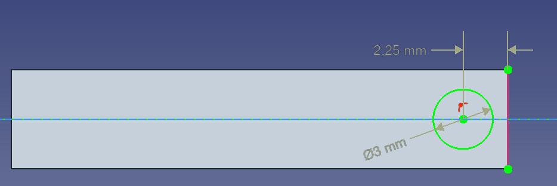
  * Save As: **ChristmasTree_Hinge.FCStd**
* Make Active Body: **Body003**
  * Select **Body004->Pocket->Sketch001**
  * Create Sub-object shape binder
  * Select **Body003->Binder**
    * set **Body003->Binder->Data->Offset: -0,25**
  * Pad **Body003->Binder**
  * 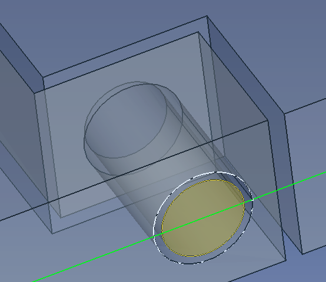
  * Select **Body003**
  * Create Sketch
    * Select feature: YZ-plane003 (Base plane)
    * Create External geometry
    * Create Circle
      * Diameter: **Spreadsheet.vBody_Hole_Diameter**
      * Center: **Spreadsheet.vBody_Hole_Center**
    * Pocket Sketch
      * Type: **Through all**
  * 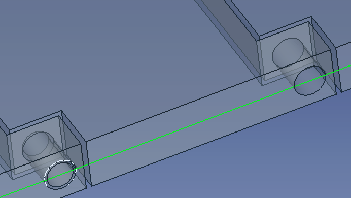
  * Save: **ChristmasTree_Hinge.FCStd**
* Make Active Body: **Body002**
  * Select **Body003->Pocket->Sketch002**
  * Create Sub-object shape binder
  * Select **Body002->Binder001**
    * set **Body002->Binder001->Data->Offset: -0,25**
  * Pad **Body002->Binder001**
  * Select **Body002**
  * Create Sketch
    * Select feature: YZ-plane002 (Base plane)
    * Create External geometry
    * Create Circle
      * Diameter: **Spreadsheet.vBody_Hole_Diameter**
      * Center: **Spreadsheet.vBody_Hole_Center**
    * Pocket Sketch
      * Type: **Through all**
  * Save: **ChristmasTree_Hinge.FCStd**
* Make Active Body: **Body001**
  * Select **Body002->Pocket->Sketch003**
  * Create Sub-object shape binder
  * Select **Body001->Binder002**
    * set **Body001->Binder002->Data->Offset: -0,25**
  * Pad **Body001->Binder002**
  * Select **Body001**
  * Create Sketch
    * Select feature: YZ-plane001 (Base plane)
    * Create External geometry
    * Create Circle
      * Diameter: **Spreadsheet.vBody_Hole_Diameter - Spreadsheet.vElement_Gap**
      * Center: **Spreadsheet.vBody_Hole_Center**
    * Pad Sketch
      * Type: **Dimension**
      * Length: **3 mm**
      * Direction->Reversed: **true**
  * 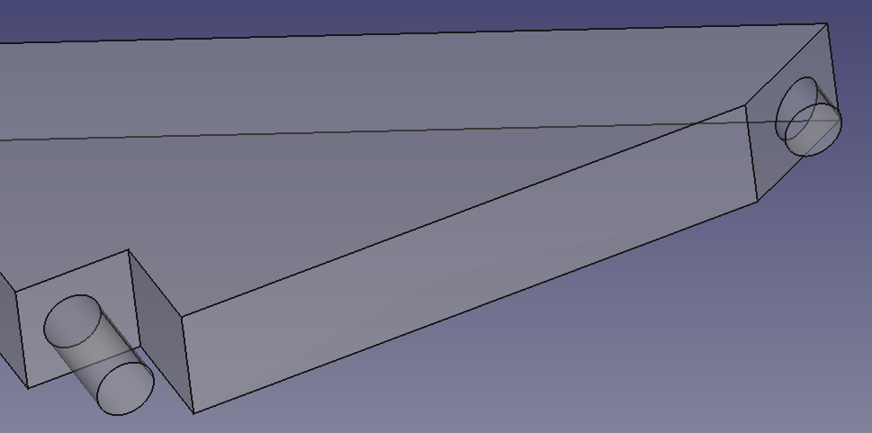
  * Save: **ChristmasTree_Hinge.FCStd**
* Make Active Body: **Body**
  * Select **Body001->Pocket->Sketch004**
  * Create Sub-object shape binder
  * Select **Body->Binder003**
    * set **Body->Binder003->Data->Offset: 0,25**
  * Pocket **Body001->Binder003**
    * Type: **Through all**
  * Select **Body**
  * Create Sketch
    * Select feature: YZ-plane (Base plane)
    * Create External geometry
    * Create Circle
      * Diameter: **1,5mm**
      * Center: **1,5mm**
    * Pocket Sketch
      * Type: **Through all**
  * 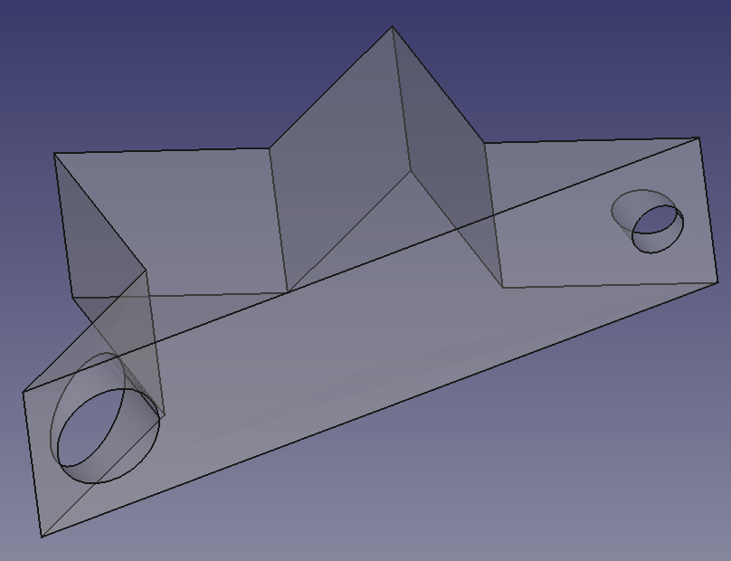
  * Save: **ChristmasTree_Hinge.FCStd**
* 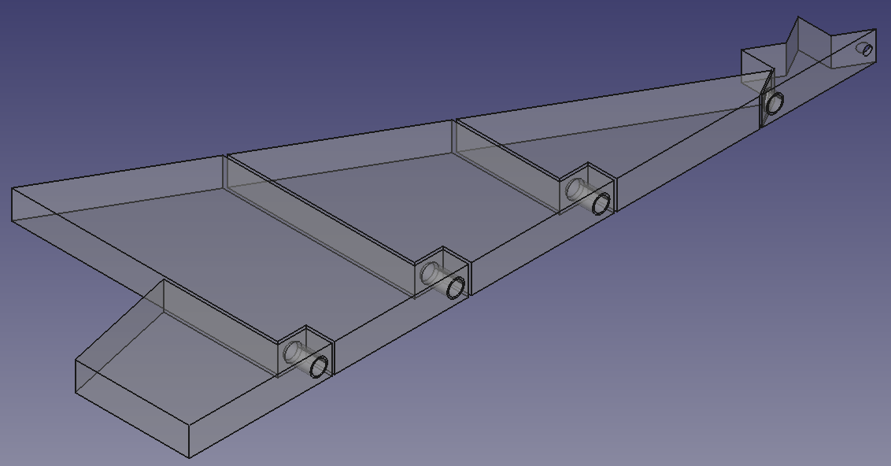

## create movement freedom and mirror Element

* Make Active Body: **Body004**
  * Create Sketch
    * Select feature: YZ-plane004 (Base plane)
    * Create External geometry
    * Create Arc
      * Radius: **Spreadsheet.vFreedom_Radius**
      * Constrain Vertical
    * Create Rectangle
    * Trim Edge
    * Pocket Sketch
      * Type: **Through all**
  * Mirror: Pad004 + Pocket + Pocket005
    * Plane: Base YZ plane
  * 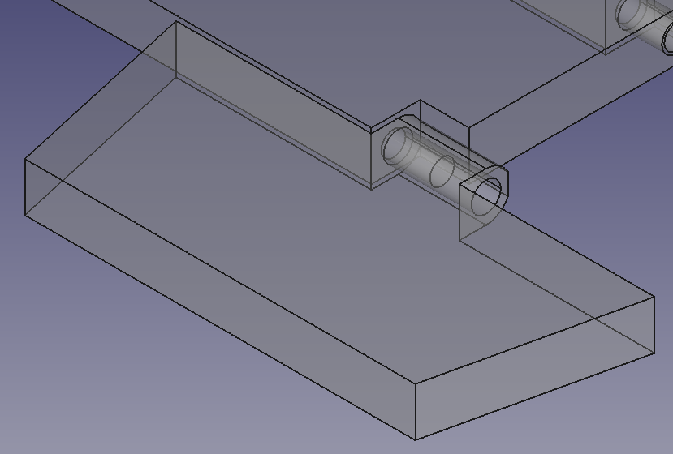
  * Save As: **ChristmasTree_Mirror.FCStd**
* Make Active Body: **Body003**
  * Create Sketch
    * Select feature: YZ-plane003 (Base plane)
    * Create External geometry
    * Create Slot
      * Radius: **Spreadsheet.vFreedom_Radius**
    * Create Rectangle
    * Pocket Sketch
      * Type: **Through all**
  * Mirror: Pad003 + Binder + Pad005 + Pocket001 + Pocket006
    * Plane: Base YZ plane
  * 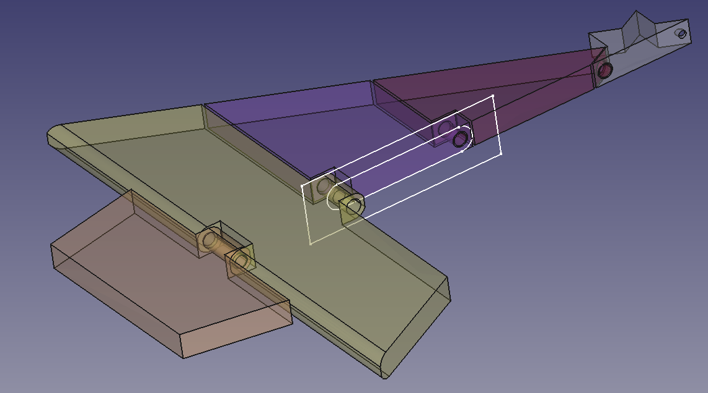
  * Save: **ChristmasTree_Mirror.FCStd**
* Make Active Body: **Body002**
  * Create Sketch
    * Select feature: YZ-plane002 (Base plane)
    * Create External geometry
    * Create Slot
      * Radius: **Spreadsheet.vFreedom_Radius**
    * Create Rectangle
    * Pocket Sketch
      * Type: **Through all**
  * Mirror: Pad002 + Binder001 + Pad006 + Pocket002 + Pocket007
    * Plane: Base YZ plane
  * 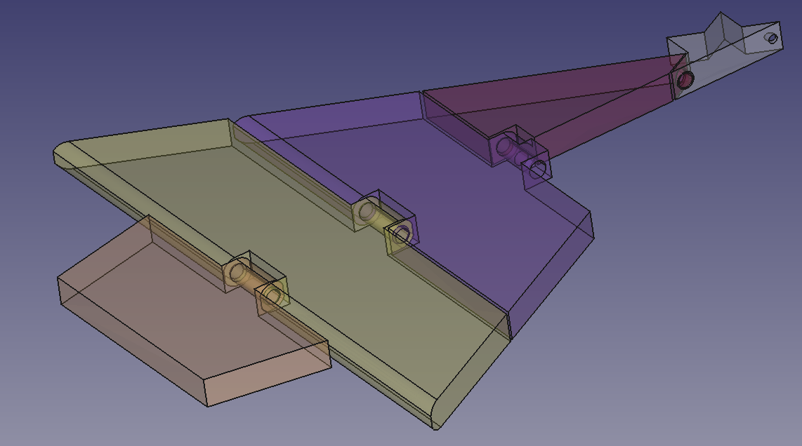
  * Save: **ChristmasTree_Mirror.FCStd**
* Make Active Body: **Body001**
  * Create Sketch
    * Select feature: YZ-plane001 (Base plane)
    * Create External geometry
    * Create Slot
      * Radius: **Spreadsheet.vFreedom_Radius**
    * Create Rectangle
    * Pocket Sketch
      * Type: **Through all**
  * Mirror: Pad001 + Binder002 + Pad007 + Pad008 + Pocket008

    * Plane: Base YZ plane
  * 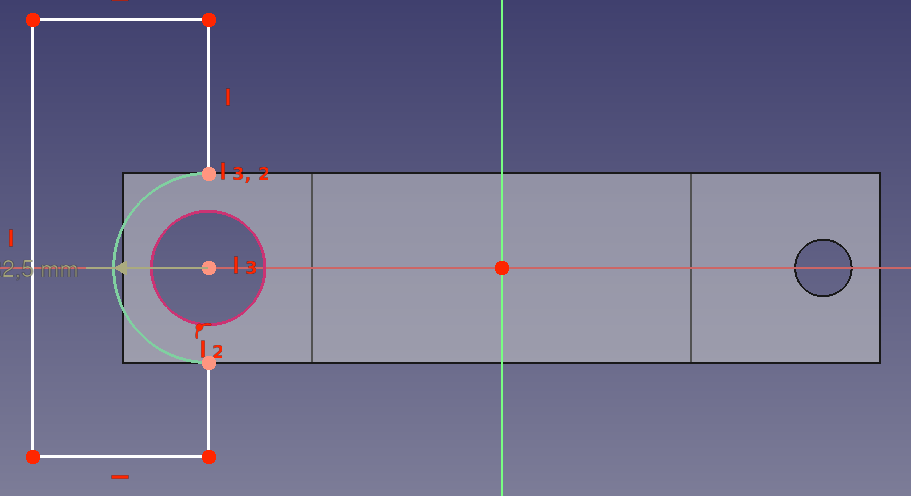
  * Save: **ChristmasTree_Mirror.FCStd**
* Make Active Body: **Body**
  * Create Sketch
    * Select feature: YZ-plane (Base plane)
    * Create External geometry
    * Create Arc
      * Radius: **Spreadsheet.vFreedom_Radius**
      * Constrain Vertical
    * Create Rectangle
    * Trim Edge
    * Pocket Sketch
      * Type: **Through all**
  * Mirror: Pad + Binder003 + Pocket003 + Pocket004 + Pocket009
    * Plane: Base YZ plane
  * 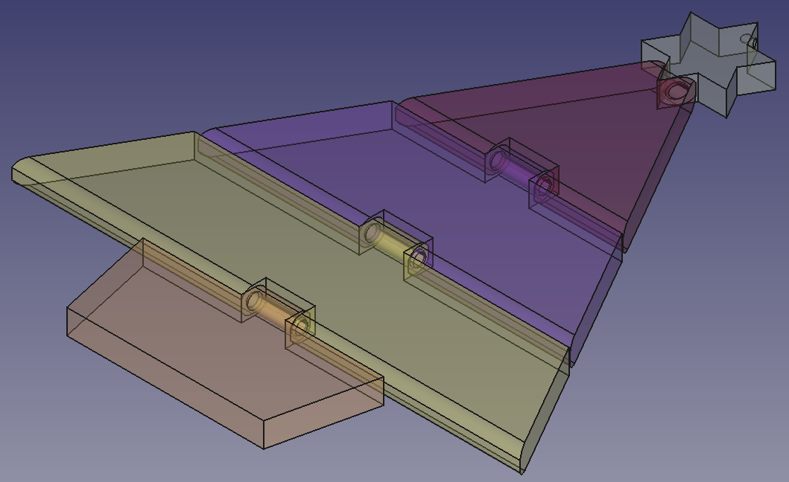
  * Save As: **ChristmasTree_Mirror.FCStd**
