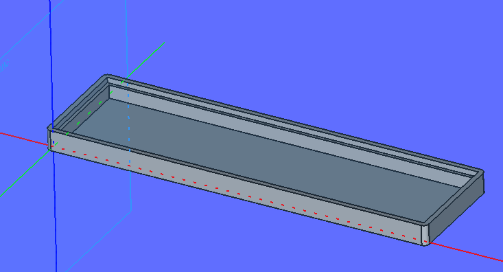
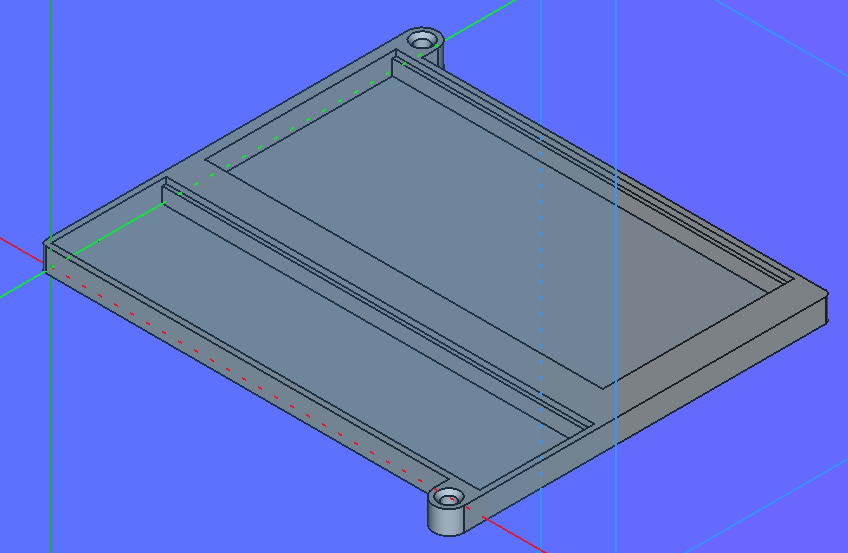

# Block Detector

## Block_Detector_med_BD20

* 
  * [Block_Detector_med_BD20_4xPCF8574N.FCStd](./Block_Detector_med_BD20_4xPCF8574N.FCStd)
  * [Block_Detector_med_BD20_4xPCF8574N-Body.3mf](./Block_Detector_med_BD20_4xPCF8574N-Body.3mf)

## Block_Detector_12_Diode

* 
  * [I2C_IO_12_Diode_Interface.FCStd](./I2C_IO_12_Diode_Interface.FCStd)
  * [I2C_IO_12_Diode_Interface-Body.3mf](./I2C_IO_12_Diode_Interface-Body.3mf)

## Block_Detector Prototype

* 
  * [I2C_IO_Interface.FCStd](./I2C_IO_Interface.FCStd)
  * [I2C_IO_Interface-Body.3mf](./I2C_IO_Interface-Body.3mf)
