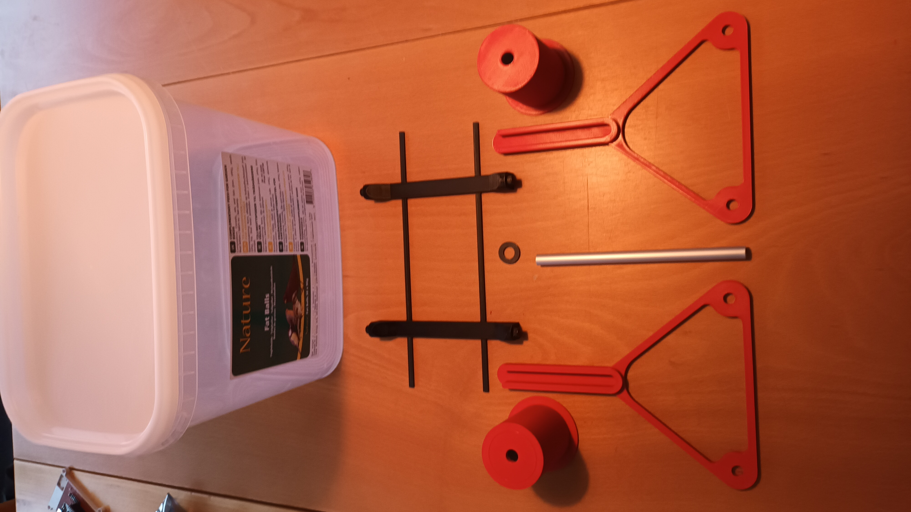
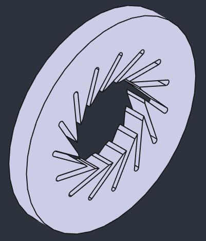
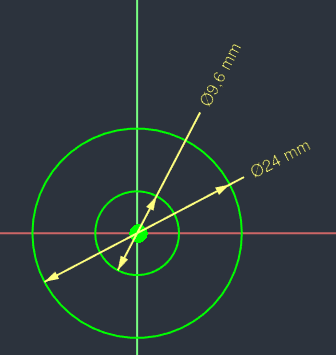
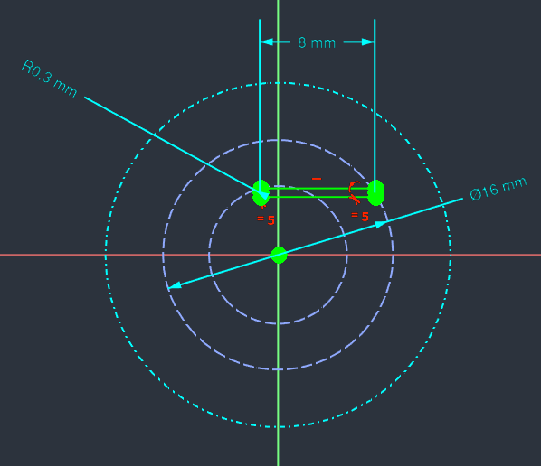
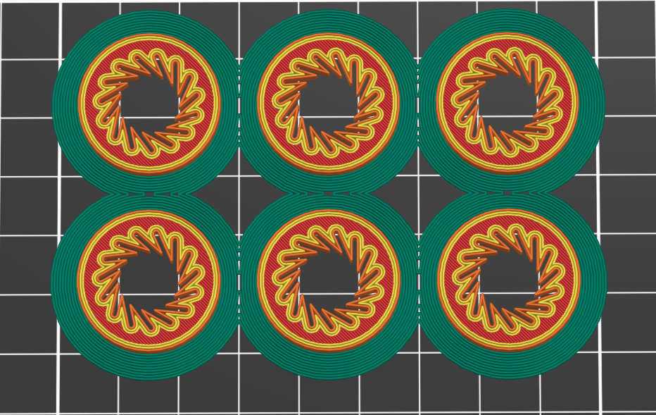
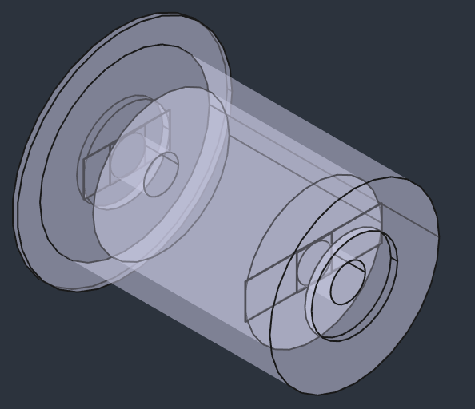
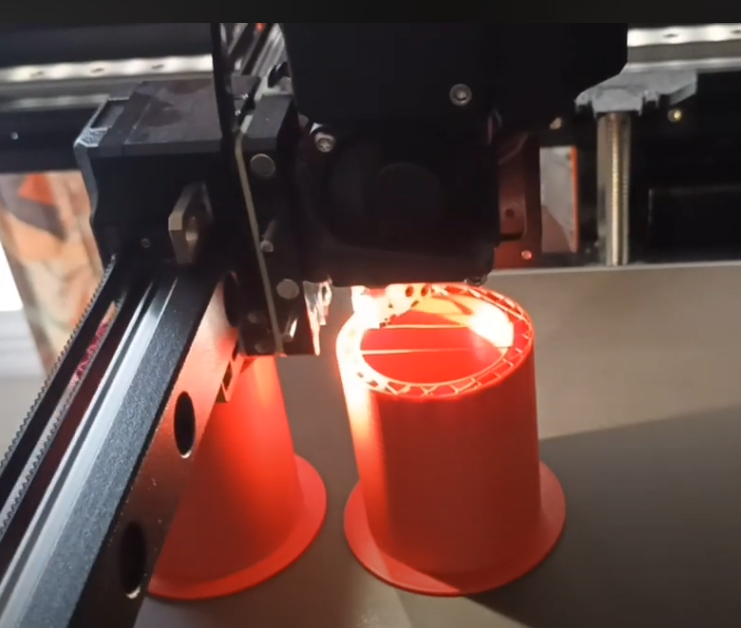

# Min Filament DryBox

## Matrialer

* [Plast boksen som kommer med Mejsebolde uden net 50-pak](https://www.harald-nyborg.dk/mejsebolde-uden-net-50-pak)
* [Jem & fix - Rør aluminium Ø10 mm × 100 cm](https://www.jemogfix.dk/roer-aluminium-oe10-mm-100-cm/4145/9032129/)
  * Rørret skæres i stykker på 161 mm

## LåseSkive for 10 mm axel

|||||
|:---:|:---:|:---:|:---:|
|Laaseskive|LaaskivePad|LaaseksivePocket|
|||||

* Låseskiven printes i PETG Filament
* PolarPattern sættes til:
  * Occurences: 15
  * Angle: 360 deg.

## ORing for 10 mm axel

|||
|:---:|:---:|
|ORing|ORingPad||
|||

* ORingen printes i PLA Filament

## Filament Bearing

|FilamentBearing| Klik for at se video om Prusa Triket|
|:---:|:---:|
|||

### Prusa Triket

|||||
|:---:|:---:|:---:|:---:|
|Pocket012 Sketch029|Pocket013 Sketch030|Pocket010 Sketch027|Pocket011 Sketch028|
|||||

* Filament Bearing printes i PLA Filament

## FreeCAD Filer

* [DryBox_003.FCStd](./DryBox_003.FCStd)

## Alumina Desiccant

* Desiccant: Act. Alumina 2-5 mm 1kg: 95,00 kr.
  * Sælger
  * [nordicfiltration](https://nordicfiltration.com/dk/
  catalogsearch/result/?q=Alumina+Desiccant)
    * ADRESSE: Glasvænget 6, 
    * 5492 Vissenbjerg, 
    * Danmark
    * TELEFON: (+45) 72 25 10 00
    * ÅBNINGSTIDER: Man - Tor / 08:00 - 16:00 - Fre / 08:00 - 15:00
  * Video:
    * [The Perfect 3D Desiccant Solution: Convenience and Longevity Combined](https://youtu.be/wkQpXBGxQdE)