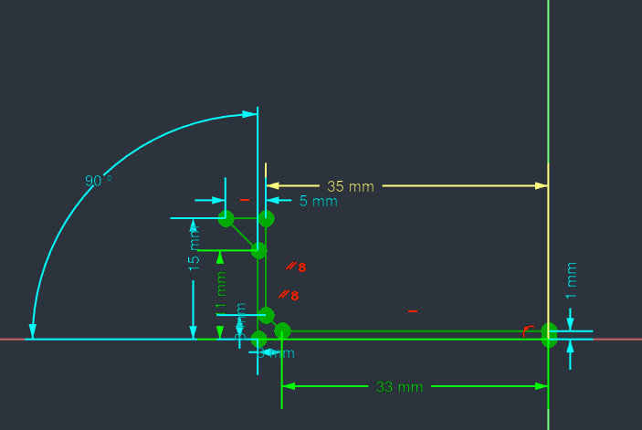
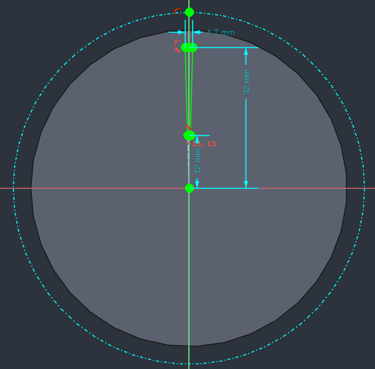

# Filamentbox

## PrintDry The Science Behind It

* [PrintDry](https://www.printdry.com)
  * [How it works](https://www.printdry.com/how-to-dry-filaments/)
  * [The Science Behind It](https://www.printdry.com/the-science-behind-it/)
  * Recommended Drying Time:

|No.|Materials|Dryer Temp|Drying Time|
|:---:|:---:|:---:|:---:|
|1|PLA|55°C (131°F)|> 3h|
|2|ABS|65°C (149°F)| 3h|
|3|PETG/CPE|65°C (149°F)| 3h|
|4|Nylon|75°C (167°F)|> 12h|
|5|Desiccant|65°C (149°F)|> 3h|
|6|PVA|45°C (113°F)| 10h|
|7|TPU/TPE|55°C (131°F)| 4h|
|8|ASA|65°C (149°F)| 4h|
|9|PP|55°C (131°F)|> 6h|
|10|HIPS|65°C (149°F)|> 4h|
|11|PC|75°C (167°F)|> 6h|
|12|PEEK|75°C (167°F)|> 6h|

## DessicantBasket

* FreeCAD Sketch:
  * DessicantBasket
    * 
    * 
    * 
* FreeCAD Files:
  * [DryBoxStorageSystem.FCStd](./DryBoxStorageSystem.FCStd)
  * [DessicantBasket](./DryBoxStorageSystem-DessicantBasket.3mf)