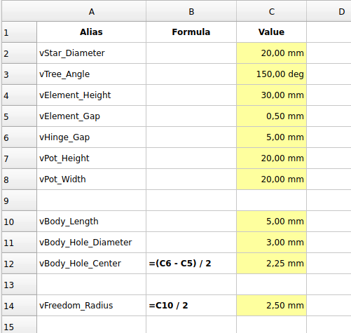

# My FreeCAD-thing

## Index

* [Tools for my Home Assistant](./README.md#tools-for-my-home-assistant)
  * [For SONOFF SNZB-01 / -03](./README.md#for-sonoff-snzb-01---03)
  * [Housing for home-built, 6 channel PWM Light Controller](./README.md#housing-for-home-built-6-channel-pwm-light-controller)
  * [Aqara Motion Sensor P1 Holder](./README.md#aqara-motion-sensor-p1-holder)
* [Tools for my House](./README.md#tools-for-my-house)
  * [IHC Replacement](./README.md#ihc-replacement)
  * [Lampeophæng for Kirsch U-skinde](./README.md#lampeophæng-for-kirsch-u-skinde)
  * [Cable suspension with parametric design (Spreadsheet)](./README.md#cable-suspension-with-parametric-design-spreadsheet)
* [FreeCAD Kursus Seniorværkstedet Ringe](./README.md#freecad-kursus-seniorværkstedet-ringe)
  * [ShapeBinder Box & Lid](./README.md#shapebinder-box--lid)
  * [Herrnhuter Sterne](./README.md#herrnhuter-sterne)
  * [Juletræ](./README.md#juletræ)
  * [Curved Shapes Workbench](./README.md#curved-shapes-workbench)
  * [Gear Intro](./README.md#gear)
* [OMJK](./OMJK.md#omjk)
  * [PCBs](./OMJK.md#pcbs)
    * [Mount for PCA9685](./OMJK.md#mount-for-pca9685-pcb)
    * [ESP32_30Pin_Expansionboard PCB](./OMJK.md#esp32_30pin_expansionboard-pcb)
    * [DSN2596 Powermodule](./OMJK.md)
    * [Mount for WR-922](./OMJK.md#mount-for-wr-typ-922-pcb)
    * [Mount for LeadDriverv6.1](./OMJK.md#mount-for-leaddriverv61)  "End of life !"
  * [Albani project](./OMJK.md#albani-project)
    * [Ølkasse](./OMJK.md#ølkasse)
  * [Flagvinduer til OMJK's model huse](./OMJK.md#flagvinduer-til-omjks-model-huse)

## Tools for my Home Assistant

### For SONOFF SNZB-01 / -03

|SNZB-01|SNZB-03|
|:---:|:---:|
|||

I have designed some hangers for SONOFF, SNZB-01 & SNZB-03, so it is easier to change the battery when the time comes.  
I attach the holders to the wall with 'NANO GEL TAPE' ISBN: 5-706245-132623 from SAM PARTNER A/S, DK-600 Kolding, Denmark, Item no. 13262.

* FreeCAD files here:
  * [SONOFF SNZB-01 ZigBee Wireless Switch](./SNZB-01/)
  * [SONOFF SNZB-03 ZigBee Motion Sensor](./SNZB-03/)

### Housing for home-built, 6 channel PWM Light Controller

* FreeCAD files here:
  * [pwm_002.FCStd](./PWM_Light_Controller/pwm_002.FCStd)
* Fritzing files for PCB here:
  * [PCB PWM_Light_Controller](https://github.com/sekt1953/Fritzing/tree/main/My_PCB/PWM_Light_Controller/)

### Aqara

#### Aqara Motion Sensor P1 Holder

* FreeCAD files here:
  * FCStd
    * [AqaraMotionSensorHolder.FCStd](./Aqara/AqaraMotionSensorP1/AqaraMotionSensorHolder.FCStd)
  * 3mf
    * [AqaraMotionSensorHolder-Version001.3mf](./Aqara/AqaraMotionSensorP1/AqaraMotionSensorHolder-Version001.3mf)

## Tools for my House

### IHC Replacement

|DIN-Box-170 in design for now|Body001||
|:---:|:---:|:---:|
||||

* FreeCAD files here:
  * FCStd:
    * [DIN-Box-170.FCStd](./IHC-Replacement/DIN-Box-170.FCStd)
  * 3mf:
    * [DIN-Box-170-Body.3mf](./IHC-Replacement/DIN-Box-170-Body.3mf)
    * [DIN-Box-170-Body001.3mf](./IHC-Replacement/DIN-Box-170-Body001.3mf)
* Fritzing files here:
  * FZZ:
    * [IHC_Replacment_001.fzz](https://github.com/sekt1953/Fritzing/blob/main/My_PCB/README.md#ihc-replacement)

### Lampeophæng for Kirsch U-skinde

|Lampeophæng||
|:---:|:---:|
|||

* FreeCAD files here: [Flagvindue.FCStd](./Lampeophæng/Lampeophaeng.FCStd)

### Cable suspension with parametric design (Spreadsheet)

|Back|Front|
|:---:|:---:|
|||

|Spreadsheet|
|:---:|
|

* FreeCAD files here:
  * [kabelophæng_Spreadsheet.FCStd](./Kabelophæng/kabelophæng_Spreadsheet_002.FCStd)
  * [kabelophæng_Spreadsheet-Body.3mf](./Kabelophæng/kabelophæng_Spreadsheet_002-Body.3mf)
  * [Spreadsheet](./Kabelophæng/kabelophæng_Spreadsheet_002.csv)
  * [Video](https://drive.google.com/drive/folders/1B0Qy-atrx_PQ4rntr0w2ogZp1AQuEfq7)

## FreeCAD Kursus Seniorværkstedet Ringe

### ShapeBinder Box & Lid

|ShapeBinder Box & Lid|Lid2|
|:---:|:---:|
|||

* FreeCAD files here:
  * FCStd
    * [ShapeBinder_BoxAndLid.FCStd](./ShapeBinder/ShapeBinder_BoxAndLid.FCStd)
  * 3mf
    * [ShapeBinder_BoxAndLid-Box.3mf](./ShapeBinder/ShapeBinder_BoxAndLid-Box.3mf)
    * [ShapeBinder_BoxAndLid-Lid.3mf](./ShapeBinder/ShapeBinder_BoxAndLid-Lid.3mf)
    * [ShapeBinder_BoxAndLid-Lid_Clearence.3mf](./ShapeBinder/ShapeBinder_BoxAndLid-Lid_Clearence.3mf)
* Video
  * sekt
    * [ShapeBinder Box & Lid](https://drive.google.com/file/d/1IJ5xImBLSEjFY-bU8gOTEWTWBXVP2fwC/view?usp=drive_link)
    * [Lid2](https://drive.google.com/file/d/1rb-1IxWUfPNLqG8V89-fgO67qp4H94P-/view?usp=drive_link)
  * Cadzis FreeCAD Beginner Tutorial.
    * [Shapebinder Explained. How to use it effectively. Must-Use tool in FreeCad](https://youtu.be/pDUWuVG13rI)
    * [How to use Shapebinder to maintain clearance between two bodies](https://youtu.be/ZIAvb7o4Z80)
    * [FreeCad - Subshapebinder and Shapebinder differences and similarities. Use it Wisely....](https://youtu.be/0YVSNauW_Ro)
    * [How to use Datum Planes, Datum Lines in Multi Body Modeling](https://youtu.be/XOkPpmZc7es)

### Herrnhuter Sterne

|Octogon|Firkant spids|Trekant Spids|
|:---:|:---:|:---:|
||||

* FreeCAD files here:
  * FCStd
    * [HerrnhuterStjerne.FCStd](./HerrnhuterStjerne/HerrnhuterStjerne.FCStd)
  * 3mf
    * [HerrnhuterStjerne-Base.3mf](./HerrnhuterStjerne/HerrnhuterStjerne-Base.3mf)
    * [HerrnhuterStjerne-StjerneFirkant.3mf](./HerrnhuterStjerne/HerrnhuterStjerne-StjerneFirkant.3mf)
    * [HerrnhuterStjerne-StjerneTrekant.3mf](./HerrnhuterStjerne/HerrnhuterStjerne-StjerneTrekant.3mf)
* Video
  * SEKT
    * [Herrnhuter Sterne](https://drive.google.com/file/d/11t6i5ICQ9I6pCZdTFd_NrP_ysMxAaNRn/view?usp=drive_link)
* Historie
  * [Om adventsstjerner](https://adventsstjerner.dk/om-adventsstjerner/)

### Juletræ

Video Kilde: [Build A Flexible Christmas Tree Decoration in FreeCAD](https://youtu.be/QQ1Ci-dyqz0 "MangoJelly Solutions for FreeCAD")

|Master Sketch|Spreadsheet|Resultat|
|:---:|:---:|:---:|
|| ||

* FreeCAD files here:
  * FCStd
    * [ChristmasTree_MasterSketch.FCStd](./ChristmasTree/ChristmasTree_MasterSketch.FCStd)
    * [ChristmasTree_ExplodeCompound.FCStd](./ChristmasTree/ChristmasTree_ExplodeCompound.FCStd)
    * [hristmasTree_PadCompound.FCStd](./ChristmasTree/hristmasTree_PadCompound.FCStd)
    * [ChristmasTree_Hinge.FCStd](./ChristmasTree/ChristmasTree_Hinge.FCStd)
    * [ChristmasTree_Mirror.FCStd](./ChristmasTree/ChristmasTree_Mirror.FCStd)
* How to Draw my ChristmasTree
  * [ChristmasTree Step by Step Guidance](./ChristmasTree/ChristmasTree_Step_by_Step_Guidance.md)

### Curved Shapes Workbench

* Kilde:
  * MangoJelly Solutions for FreeCAD
    * [EASIEST Boat Build in FreeCAD! Unleashing the Magic of Curved Shapes Workbench](https://youtu.be/-539fgU50Bw "MangoJelly Solutions for FreeCAD")
    * [FreeCAD Curved Surfaces the Easy Way | Helicopter Canopy | Protogen Helmet Visor](https://youtu.be/VMO4Huil4-k "MangoJelly Solutions for FreeCAD")
    * [FreeCAD Curves Workbench](https://www.youtube.com/playlist?list=PLWuyJLVUNtc3qvjX-xWLeHHlpYPiEKMmC)

### Gear

* Kilde:
  * [ELEMENTS OF METRIC GEAR TECHNOLOGY](https://qtcgears.com/tools/catalogs/PDF_Q420/Tech.pdf)
  * CAE+
    * [Gear Types, Design Basics, Applications and More - Basics of Gears](https://youtu.be/ZhDO16FDmxA "CAE+")
  * How To Mechatronics
    * [How Planetary Gears Work | 3D Printed Planetary Gearbox Design and Test](https://youtu.be/Ho4AniHtgxM "How To Mechatronics")
  * PDW Creative
    * [Spur Gear Design 1 - How gears work](https://www.youtube.com/watch?v=IBcGLpQnfYk "PDW Creative")
    * [Spur Gear Design 2 - Involute of the circle](https://youtu.be/gt_Ofn95ML0 "PDW Creative")
    * [Spur Gear Design 3 - Construct, Edit and Animate](https://youtu.be/3ixCxjDkmV0 "PDW Creative")
    * [Metric screw thread](https://youtu.be/C4hblJGoTJk "PDW Creative")
  * Machining-Tutorials
    * [Thread Anatomy- (In less than 5 min!)](https://youtu.be/tkEVwpl2S4Q "Machining-Tutorials")
  * [freecad gears tutorial](https://www.youtube.com/results?search_query=freecad+gears+tutorial)
    * [MangoJelly Solutions for FreeCAD](https://www.youtube.com/@MangoJellySolutions)
    * [FreeCAD For Beginners 33 | Gear Assembly, Animation and Export to Video File
](https://youtu.be/lBtnTuwqhqc "MangoJelly Solutions for FreeCAD")
    * [Tabletop Robotics](https://www.youtube.com/@TabletopRobotics)
    * [How to make gears in Freecad](https://youtu.be/8VNhTrnFMfE "Tabletop Robotics")
* [FreeCAD Documentation](https://wiki.freecad.org/Main_Page)
  * [FCGear Workbench](https://wiki.freecad.org/FCGear_Workbench)

## [How To Make Gears In FreeCAD 0.20 - Gear Generator - FreeCAD Gear Tutorial](https://youtu.be/snlNjgbMn48)

* [How to make (External) Gears in FreeCAD](https://youtu.be/snlNjgbMn48)
  * T1 Involete parameter:
    * Number of teeth: 20
    * Module: 2,50 mm
    * Pressure angle: 20,00 Deg
    * High precision: True
    * External gear: True
  * T1 Involete parameter:
    * Number ag teeth: 10
    * Module: 2,50 mm
    * Pressure angle: 20
    * High precision: True
    * External gear: True
  * Beregn Gear hjul center afstand:
    * **(Module * (T1 + T2))/2** ~ (2.50 * (20+10)/2 = 37,5) 
     

## [FreeCAD for OMJK](./OMJK.md)

* [FreeCAD PCB support](./OMJK.md#pcbs)
* [FreeCAD Albani](./OMJK.md#albani-project) 
